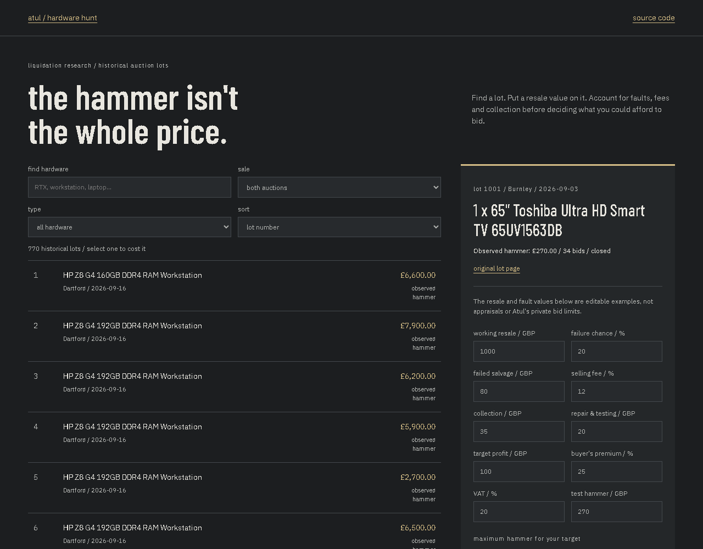

# hardware hunt

**[Open the bid desk](https://lolstar123.github.io/hardware-hunt/)**

An auction research and costing tool for hardware liquidation. Browse 770 actual historical lots, find the machines or components you care about, and work backwards from resale value to a maximum hammer bid.



## Try it

Search for RTX, workstation, laptop or a lot number. Select a lot to load its auction's actual premium and VAT assumptions. Enter your own resale value, failure probability, salvage, selling fees, collection, repair budget and profit target. The result updates immediately, showing cash costs, expected profit and the failed-item downside. Save several lots, revisit their assumptions and download a CSV bid sheet.

The prefilled resale and fault values are examples, not appraisals. The lot price is the historical observed hammer. A closed lot does not prove reserve was met or the sale completed. No bids are placed.

## Actual records, private limits excluded

- Exertis / MBV, Burnley, 3 September 2026: 693 lots; 25% buyer premium.
- No.8 Sound & Vision / Pantera, Dartford, 16 September 2026: 77 lots; 17.5% buyer premium.
- Both examples apply 20% VAT to hammer and premium, without assuming VAT recovery.

The [exporter](tools/export_lots.py) copies only public titles, lot numbers, dates, observed hammers, bid counts, close flags and source links. It does not export private bid caps, resale estimates or bidder identities. The original watcher tracked bids and extensions; this public app investigates its final snapshots.

## Calculation

Expected proceeds = working resale x (1 - failure probability) + salvage x failure probability, after selling fees. Deduct collection, repairs and target profit. Divide what remains by (1 + premium) x (1 + VAT) to obtain the maximum hammer. If fixed costs alone defeat the target, the tool says so. The bid ceiling must be rounded down to a valid auction increment.

## Run and check

```sh
python -m http.server 8000 --directory examples/portfolio
node --test examples/portfolio/model.test.mjs
pip install playwright
python -m playwright install chromium
python tools/browser_audit.py
```

Open http://localhost:8000. No API key or login. [Calculation code](examples/portfolio/model.mjs), [interface](examples/portfolio/app.mjs), [public dataset](examples/portfolio/data/lots.json), [provenance](PROVENANCE.md).
