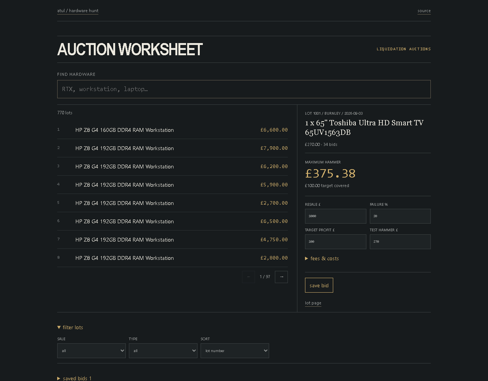

# Hardware Hunt

[Open the auction bid desk](https://lolstar123.github.io/hardware-hunt/) | [Calculation code](examples/portfolio/model.mjs) | [Data provenance](PROVENANCE.md)

Browse 770 historical liquidation lots and work backwards from resale assumptions to a maximum hammer bid. The catalogue keeps observed auction facts beside the cost model, so the price paid at auction cannot be mistaken for an appraisal.



## Cost a lot

1. Search by hardware or lot number, then filter by sale or type. Sort by lot number or observed hammer and page through the catalogue.
2. Select a lot. Its original title, observed hammer, bid count, sale date and source link appear at the bid desk; its sale's buyer premium and VAT fill the fee fields.
3. Enter working resale, failure probability and target profit. Open **Fees, salvage & collection** to change salvage, selling fees, collection and repairs.
4. Use **Test hammer** to inspect acquisition cost, expected profit and the working/failed outcomes at a proposed bid. The maximum hammer is the ceiling for your target expected profit, not the highest bid that can never lose money.
5. **Save bid** keeps the assumptions in this browser. Reopen saved lots to revise them, remove entries or download a CSV bid sheet.

The opening RTX 3070 example deliberately keeps the historical hammer and editable resale inputs separate. Prefilled resale and failure values are examples, not appraisals. Condition, reserve clearance and completed settlement are unverified; no bids are placed.

## Records and fees

| Archived sale | Lots | Buyer premium |
| --- | ---: | ---: |
| Exertis / MBV, Burnley, 3 September 2026 | 693 | 25% |
| No.8 Sound & Vision / Pantera, Dartford, 16 September 2026 | 77 | 17.5% |

Both examples start with 20% VAT on hammer and premium, without VAT recovery. These are the archived sales' fee assumptions, not terms for a future auction. Unknown hammers stay unknown in the catalogue and CSV; a zero in the editable test field is an assumption.

The exporter allowlists public titles, lot numbers, dates, observed hammers, aggregate bid counts, close flags and catalogue links. It excludes private bid caps, resale floors and bidder identities. The original watcher recorded bids and extensions; this app investigates its final snapshots.

## Calculation

```text
Net working resale = resale x (1 - selling fee)
Net failed resale  = salvage x (1 - selling fee)
Expected proceeds  = net working resale x (1 - failure) + net failed resale x failure
Available for bid  = expected proceeds - collection - repairs - target profit
Maximum hammer     = max(0, available / ((1 + premium) x (1 + VAT)))
```

Percentages become fractions in the model. Cash cost at the test hammer includes hammer, premium, VAT, collection and repairs. The downside uses the same cash cost and failed-item salvage. If fixed costs defeat the profit target, the desk says so even at a zero hammer.

Displayed and exported ceilings round down to pennies. **Round down again to the auction's valid bid increment** before bidding; the app does not know that increment.

## Run and verify

The demo needs Python for the local server and a modern browser. It works offline with the bundled catalogue; no login or API key is needed. Checked with Python 3.11, Node 24 and isolated Chrome.

```sh
python -m http.server 8000 --directory examples/portfolio
```

Open **http://localhost:8000**. Run checks from a second terminal:

```sh
node --test examples/portfolio/model.test.mjs
python -m pip install playwright
python tools/browser_audit.py
```

Windows audits use installed Google Chrome. On Linux/macOS, first run `python -m playwright install chromium`. Model checks cover public-field limits, fee arithmetic, impossible targets and invalid inputs. Browser checks cover filtering, pagination, cost changes, actual sale fees, saved-sheet persistence/restore/delete, CSV and load recovery at 1280px and 390px. Screenshots and the check record live in ignored `output/qa/`.

## Code map

| Path | Responsibility |
| --- | --- |
| `examples/portfolio/model.mjs` | Categories, fee/risk calculation and CSV quoting |
| `examples/portfolio/app.mjs` | Catalogue selection, inputs, saved sheet and export |
| `examples/portfolio/data/lots.json` | Allowlisted public records and archived sale fees |
| `examples/portfolio/style.css` | Auction-desk layout and responsive states |
| `tools/export_lots.py` | Allowlisted export from the original watcher snapshots |
| `tools/browser_audit.py` | Functional browser checks and visual evidence |
| `DESIGN.md` | Tokens, product layout and acceptance checklist |
